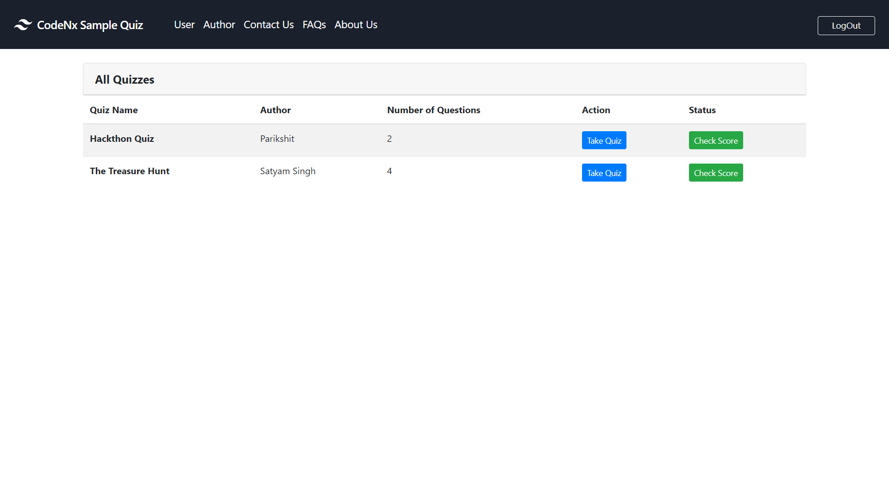
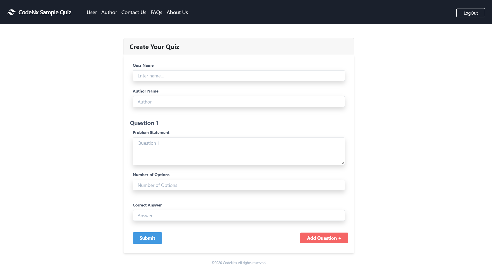

# A sample webapp for Online quiz
This is an online platform deal with online quizzes.
The Application is divided into **Two** different category

_**User**_  
_**Author**_  

1. **User App** -  

_Description_ - For taking quizzes and getting the report card

2. **Author** -  

_Description_ - For posting Quizzes

# Web Application on the following Tech-Stack:
TailWindCSS, NodeJS, Bootstrap, VueJs, JQuery, MongoDB

# Pre-requisite - 
* MongoDB. https://docs.mongodb.com/manual/installation/ .
* NodeJS. https://nodejs.org/en/download/ .
* VueCLI. https://vuejs.org/v2/guide/installation.html .

# Pre-running setup-
1. Before running the server you need to run a command to for your database to operate. So to do that use command 
 -> mongod .
 After doing that you're machine will listen for database connections.
2. The you need to run your server. For doing this go to APi folder and run command 
-> npm run start.
  After doing this your API server is ready to run

3. Running client side VueJS server - 
  Go to quizApp folder. Run command 
 -> npm run dev 
 
4. Now go to your browser and type http://localhost:8080. 
Done
Here is your fully functional Sample Quiz App
